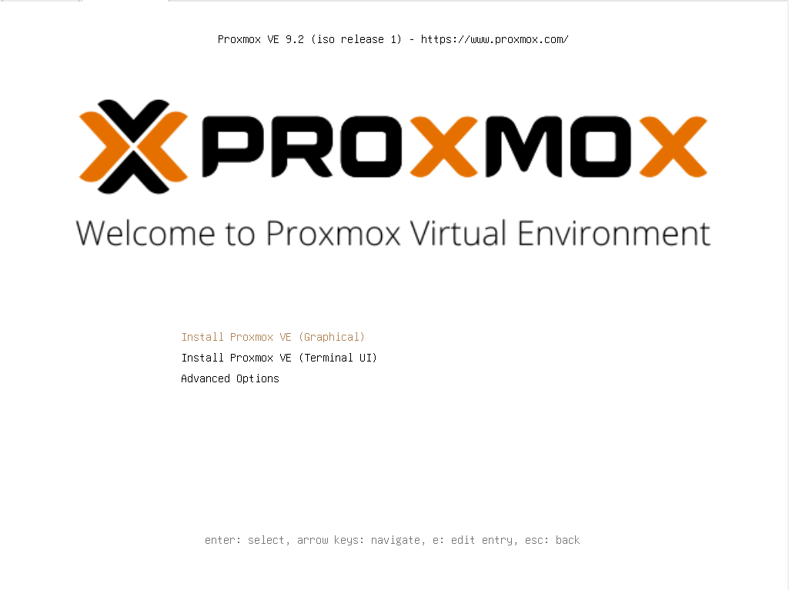
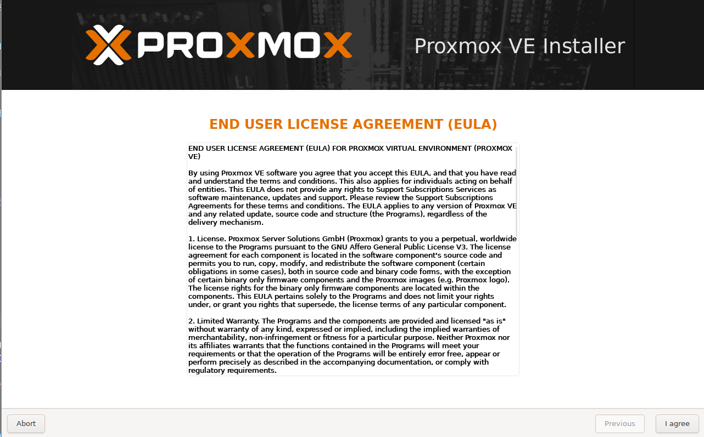
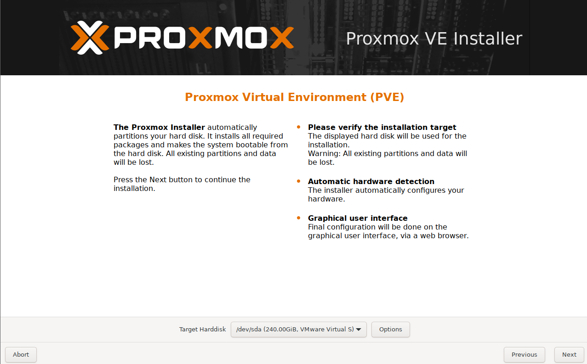
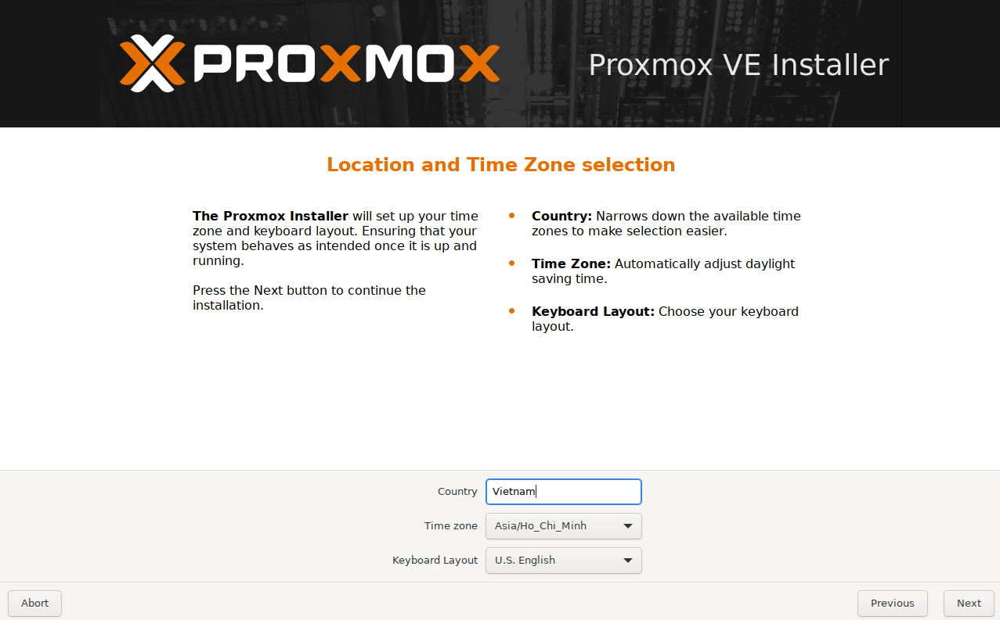
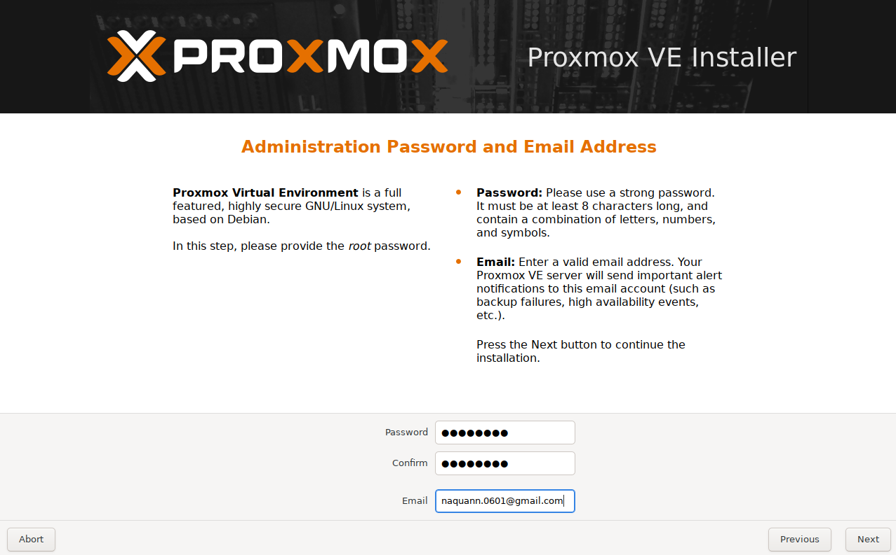
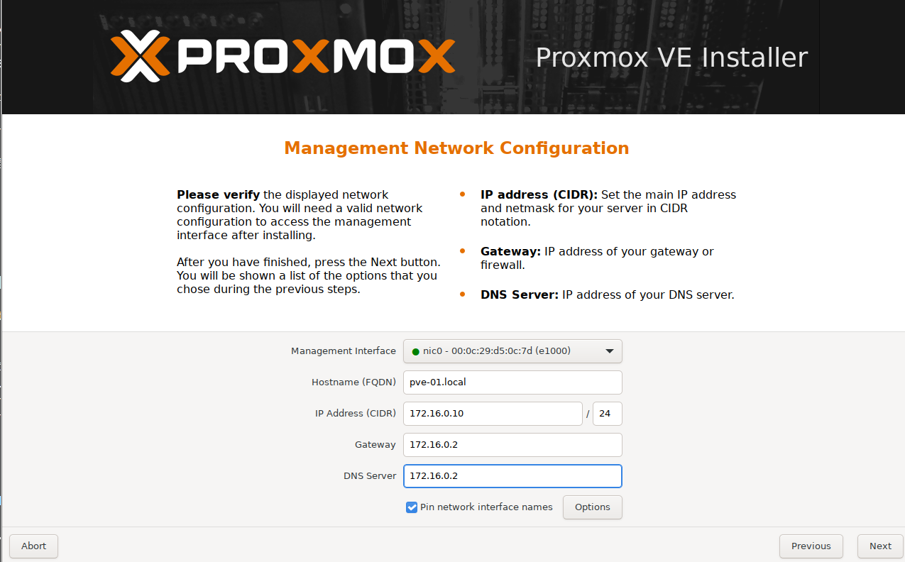
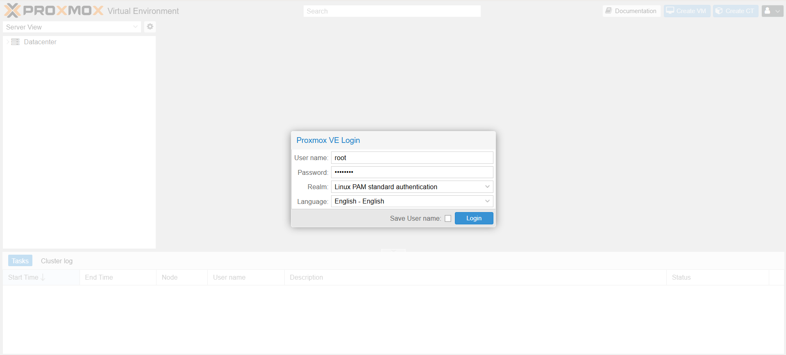

# 01 · Proxmox VE Installation on VMware

## Objective

Triển khai môi trường **Proxmox Virtual Environment (PVE)** dưới dạng **Nested Virtualization** trên nền tảng **VMware Workstation / ESXi** để phục vụ mô phỏng hạ tầng **Enterprise Private Cloud**.

Sau khi hoàn tất bước này, bạn sẽ:

- Sở hữu một VM Proxmox VE hoạt động ổn định trên VMware.
- Kích hoạt thành công tính năng ảo hóa lồng nhau (Nested Virtualization).
- Truy cập được Web UI và sẵn sàng triển khai các thành phần mở rộng tiếp theo.

---

## Environment

| Component | Value | Note |
|---|---|---|
| Hypervisor | VMware Workstation / ESXi | Nền tảng chạy VM Proxmox |
| Guest OS Type | Debian 13 (64-bit) hoặc bản Debian cao nhất | Tùy chọn khi tạo VM |
| Hostname | `pve01` | Tên định danh Node |
| CPU | ≥ 8 vCPUs | **Bắt buộc bật Nested Virtualization** |
| RAM | ≥ 14 GB | Khuyến nghị 16 GB+ |
| Disk | ≥ 240 GB | Khuyến nghị SSD / NVMe |
| Network | Bridged Adapter | Cùng dải mạng với máy Host |

---

# Step 1 · Create VM & Enable Nested Virtualization

Đây là bước quan trọng nhất. Nếu không bật Nested Virtualization, Proxmox sẽ không thể sử dụng KVM để chạy VM bên trong.

## 1.1 Create Virtual Machine

Tạo VM mới trên VMware:

- Chọn **Custom (Advanced)**

Khi chọn hệ điều hành:

```text
Guest OS: Linux
Version: Debian 13.x 64-bit (hoặc version mới nhất)
```

> Proxmox VE 9.x được xây dựng trên nền Debian 13.

---

## 1.2 Enable Nested Virtualization

⚠️ Bắt buộc thực hiện trước khi boot ISO Proxmox.

### VMware Workstation

Mở:

```text
VM
→ Settings
→ Processors
```

Tích chọn:

```text
[x] Virtualize Intel VT-x/EPT or AMD-V/RVI
```

Nhấn **OK**

---

### VMware ESXi

Mở:

```text
VM
→ Edit Settings
→ CPU
```

Tích chọn:

```text
[x] Expose hardware assisted virtualization to the guest OS
```

Nhấn **Save**

---

# Step 2 · Mount Proxmox VE ISO

Không cần tạo USB Boot vì cài trực tiếp trên VMware.

- Tải ISO Proxmox VE
- Mở **VM Settings**
- Chọn **CD/DVD (SATA)**
- Chọn:

```text
Use ISO image file
```

- Chọn file ISO

Đảm bảo bật:

```text
[x] Connect at power on
```

---

# Step 3 · Install Proxmox VE

Khởi động VM.

Tại Boot Menu:

```text
Install Proxmox VE (Graphical)
```



---

## License Agreement

Chọn:

```text
I agree
```



---

## Target Disk

Chọn ổ đĩa:

```text
/dev/sda
```



---

## Localization

```text
Country: Vietnam
Timezone: Asia/Ho_Chi_Minh
Keyboard: U.S. English
```



---

## Management Password

Thiết lập:

- Root Password
- Notification Email



---

## Network Configuration

Ví dụ:

```text
Management Interface: ens33
Hostname: pve-01.local

IP Address: 172.16.0.10/24
Gateway: 172.16.0.2
DNS Server: 8.8.8.8
```



Kiểm tra lại thông tin.

Nhấn:

```text
Install
```

Sau khi hoàn tất hệ thống sẽ tự reboot.

---

# Step 4 · Access Web Interface

Mở trình duyệt:

```text
https://172.16.0.10:8006
```

Bỏ qua cảnh báo SSL.

Đăng nhập:

```text
Username: root
Password: <root_password>

Realm:
Linux PAM standard authentication
```

---

# Step 5 · Update System & Configure Repository

Mặc định Proxmox sử dụng Enterprise Repository.

Đối với môi trường Lab, chuyển sang No-Subscription Repository.

---

## 5.1 Verify Repository

```bash
ls -l /etc/apt/sources.list.d/
```

---

## 5.2 Disable Enterprise Repository

```bash
mv /etc/apt/sources.list.d/pve-enterprise.sources \
/etc/apt/sources.list.d/pve-enterprise.sources.disabled
```

---

## 5.3 Disable Ceph Repository (Optional)

Nếu không dùng Ceph:

```bash
mv /etc/apt/sources.list.d/ceph.sources \
/etc/apt/sources.list.d/ceph.sources.disabled
```

---

## 5.4 Add No-Subscription Repository

Tạo file:

```bash
nano /etc/apt/sources.list.d/pve-no-subscription.list
```

Thêm nội dung:

```text
deb http://download.proxmox.com/debian/pve trixie pve-no-subscription
```

Lưu:

```text
Ctrl + O
Enter
Ctrl + X
```

---

## 5.5 Update System

```bash
apt update
apt full-upgrade -y
```

---

## 5.6 Reboot (Recommended)

```bash
reboot
```

---

# Step 6 · Verify Installation

## 6.1 Verify Nested Virtualization

```bash
egrep -c '(vmx|svm)' /proc/cpuinfo
```

Kết quả mong đợi:

```text
> 0
```


---

## 6.2 Verify Proxmox Services

```bash
systemctl status \
pveproxy \
pvedaemon \
pvestatd
```

Trạng thái:

```text
active (running)
```

Nhấn:

```text
q
```

để thoát.

---

## 6.3 Verify Network Bridge

```bash
ip a show vmbr0
```

---

# Result

- [x] Proxmox VE hoạt động ổn định trên VMware
- [x] Nested Virtualization đã hoạt động
- [x] Repository đã chuyển sang No-Subscription
- [x] Hệ thống đã cập nhật thành công
- [x] Sẵn sàng triển khai Storage, pfSense và Virtual Machines