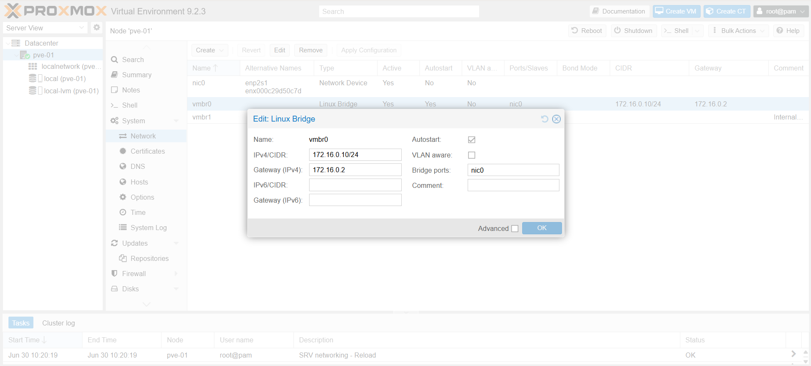
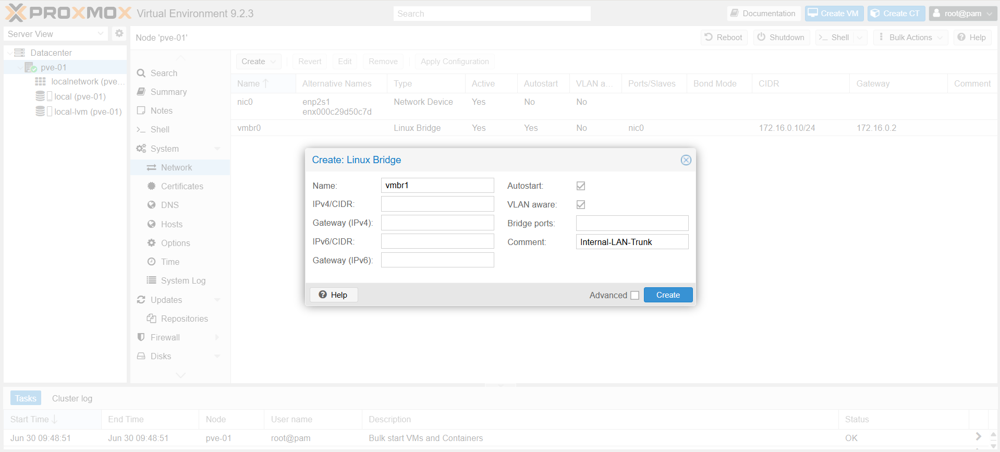
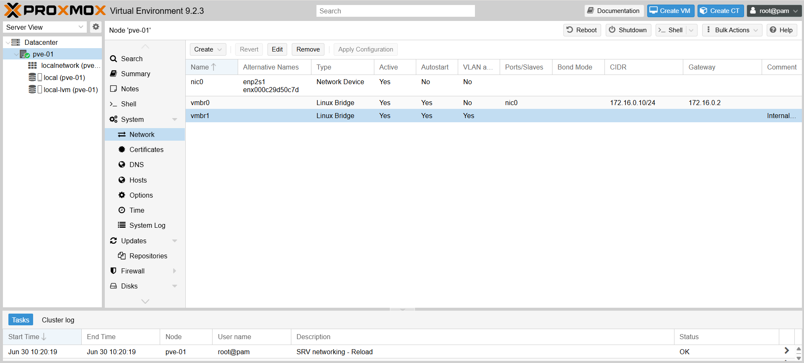
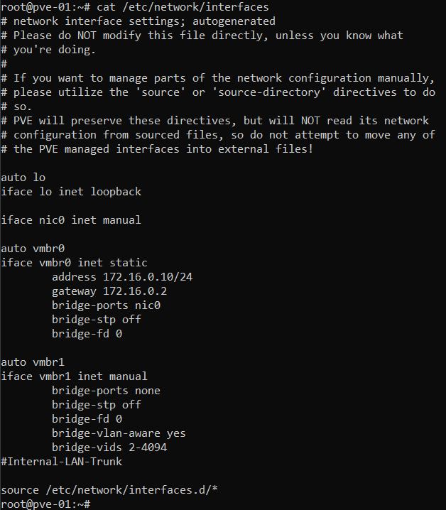

# 02 · Virtual Networking Configuration

## Objective

Thiết lập hạ tầng mạng ảo hóa (Virtual Network) trên Proxmox VE. 
Mục tiêu của bước này là chuẩn bị các "Switch ảo" (Linux Bridge) làm nền tảng để triển khai tường lửa pfSense, định tuyến lưu lượng mạng và tạo môi trường cách ly an toàn cho các máy ảo nội bộ.


---

## Network Topology (Proxmox Layer)

Ở tầng Hypervisor, hệ thống mạng được quy hoạch thành 2 Bridge chính:

| Bridge Name | Physical Port | VLAN Aware | Vai trò (Role) | Chức năng đối với VM |
| :--- | :--- | :--- | :--- | :--- |
| **`vmbr0`** | `nic0` | No | **External / Management** | Cổng WAN cho pfSense / Cổng truy cập Web UI của Proxmox. |
| **`vmbr1`** | | **Yes** | **Internal / Trunking** | Cổng LAN nội bộ. Đóng vai trò là Switch ảo cho toàn bộ Private Cloud. |

---

## Step 1 · Inspect Default Bridge (`vmbr0`)

Ngay sau khi cài đặt Proxmox, hệ thống đã tự động tạo sẵn `vmbr0`. Đây là cầu nối giữa mạng ảo và mạng vật lý của bạn.

1. Đăng nhập vào Proxmox Web UI.
2. Chọn Node hệ thống (VD: `pve01`) ở thanh điều hướng bên trái.
3. Chuyển sang menu **System** → **Network**.
4. Kiểm tra dòng `vmbr0`:
   * Đảm bảo nó đã được gán IP tĩnh (VD: `172.16.0.10`).
   * Cột **Ports/Slaves** đã được gắn đúng tên card mạng vật lý (VD: `ens33` hoặc `eth0`).




---

## Step 2 · Create Internal Bridge (`vmbr1`)

Đây là bước cốt lõi để tạo ra một vùng mạng khép kín. Toàn bộ các Server và Client sau này sẽ cắm vào Bridge này.

1. Tại giao diện **Network**, chọn **Create** → **Linux Bridge**.
2. Thiết lập các thông số sau:
   * **Name:** `vmbr1` (Mặc định hệ thống tự điền).
   * **IPv4/CIDR:** *(Bỏ trống - Proxmox không cần IP ở dải mạng này).*
   * **Gateway (IPv4):** *(Bỏ trống).*
   * **Bridge ports:** *(Bỏ trống - Để cách ly hoàn toàn vùng mạng này khỏi mạng vật lý bên ngoài).*
   * **VLAN aware:** Tích chọn `[x]` *(Rất quan trọng: Bắt buộc bật để pfSense có thể truyền các VLAN 10, 20, 30 qua cổng này).*
   * **Comment:** `Internal-LAN-Trunk`
3. Nhấn **Create**.



---

## Step 3 · Apply Configuration

Lúc này, cấu hình mới chỉ được lưu nháp.

1. Nhấn nút **Apply Configuration** (Apply Network Config) ở menu trên cùng để Proxmox áp dụng card mạng mới mà không cần khởi động lại.
2. Đợi thanh tiến trình hoàn tất. Trạng thái (Active) của `vmbr1` sẽ chuyển sang `Yes`.

*(Lưu ý: Nếu nút Apply bị lỗi do thiếu gói ifupdown2, bạn có thể áp dụng bằng cách khởi động lại node Proxmox thông qua lệnh `reboot` trong Shell).*




---

## Step 4 · Verify Network Configuration via Shell (Optional)

Bạn có thể kiểm tra cấu hình mạng đã được ghi vào file cấu hình gốc của Debian bằng lệnh sau trong Shell:

```bash
cat /etc/network/interfaces

```

Kết quả hiển thị chuẩn sẽ có dạng:



---

## Result Check-list

* [x] Nắm rõ cấu trúc mạng ở tầng ảo hóa của Proxmox.
* [x] Đã tạo thành công `vmbr1` hoàn toàn cách ly với card mạng vật lý.
* [x] Tính năng **VLAN aware** đã được bật trên `vmbr1` để chuẩn bị cho chia VLAN.


