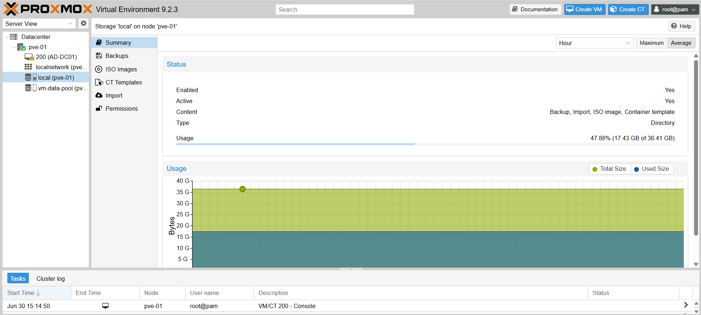
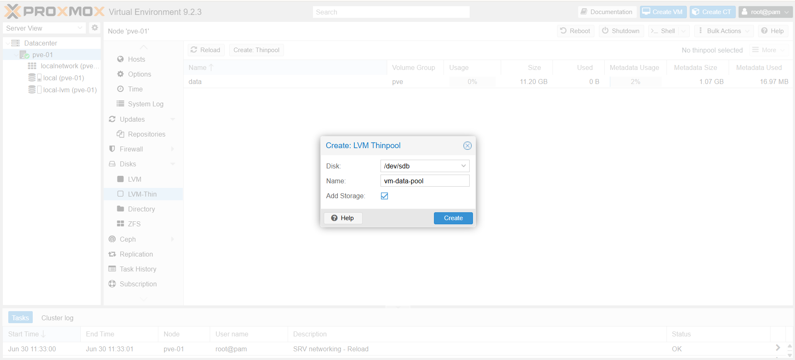
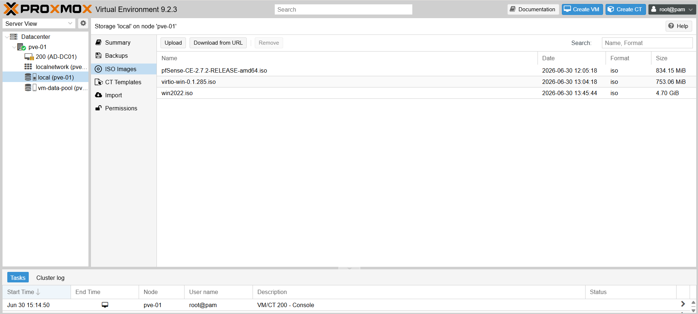

# 03 · Proxmox Storage Configuration

## Objective

Thiết lập và quy hoạch không gian lưu trữ (Storage Pool) ở tầng Hypervisor (Proxmox VE). 
Giai đoạn này đảm bảo Proxmox có đủ không gian và cấu trúc hợp lý để lưu trữ các file bộ cài (ISO) và ổ cứng ảo (Virtual Disks) của các hệ thống máy chủ/máy khách sắp triển khai.

---

## Storage Architecture (Proxmox Layer)

Mặc định sau khi cài đặt, Proxmox tự động chia ổ cứng hệ thống thành 2 phân vùng lưu trữ chính:

| Storage ID | Type | Content Types (Mục đích) | Ghi chú |
| :--- | :--- | :--- | :--- |
| **`local`** | Directory | VZDump backup file, **ISO image**, Container template | Dạng File System thông thường. Nơi upload các file cài đặt. |
| **`local-lvm`** | LVM-Thin | **Disk image**, Container | Dạng Block Storage (Tốc độ cao). Nơi lưu trữ ổ C:/D: của các máy ảo. |

---

## Step 1 · Inspect Default Storage

Kiểm tra trạng thái lưu trữ mặc định để đảm bảo hệ thống nhận diện đủ dung lượng.

1. Đăng nhập vào Proxmox Web UI.
2. Ở cột Server View bên trái, mở rộng Node `pve01`.
3. Nhấp vào **`local (pve01)`** .
4. Chọn tab **Summary** để kiểm tra dung lượng trống (Usage). 

---

## Step 2 · Add Secondary Disk for VM Data (Optional but Recommended)

Trong môi trường Enterprise thực tế, OS của Hypervisor và Data của VM luôn được tách biệt ở các mảng đĩa khác nhau. Ta có thể mô phỏng điều này trên VMware:

### 2.1 Cấp phát thêm ổ cứng từ VMware
1. Mở **VMware Settings** của máy ảo Proxmox.
2. Nhấn **Add...** → **Hard Disk** → **NVMe/SCSI**.
3. Create a new virtual disk → Dung lượng: `200` GB.
4. Bật Proxmox VM lên (Hoặc Reboot nếu đang bật).

### 2.2 Khởi tạo Storage mới trên Proxmox
1. Truy cập Web UI → Chọn Node `pve01` → Menu **Disks**.
2. Nhấn nút **Reload**, bạn sẽ thấy một ổ đĩa mới xuất hiện (`/dev/sdb` - 200GB).
3. Chuyển xuống menu **Disks** → **LVM-Thin**.
4. Nhấn **Create: Thinpool**.
   * **Disk:** Chọn ổ đĩa mới (`/dev/sdb`).
   * **Name:** `vm-data-pool`
   * **Add Storage:** Tích chọn `[x]`.
5. Nhấn **Create**.
*(Lúc này, bạn có thể tạo máy ảo và lưu ổ cứng của chúng vào `vm-data-pool` thay vì `local-lvm` mặc định).*

---

## Step 3 · Upload ISO Images

Chuẩn bị sẵn các bộ cài hệ điều hành để phục vụ cho các Phase tiếp theo.

### Danh sách ISO cần chuẩn bị:
* `pfSense-CE-*.iso` (Tường lửa - Dùng cho Phase 2)
* `Windows_Server_2022.iso` (Active Directory - Dùng cho Phase 3)
* `TrueNAS-SCALE-*.iso` (Enterprise Storage - Dùng cho Phase 4)
* `Windows_10_Client.iso` (Máy khách - Dùng cho test policy)

### Cách Upload vào Proxmox:
1. Ở cột bên trái, chọn **`local (pve01)`**.
2. Chuyển sang mục **ISO Images**.
3. Nhấn **Upload** (Hoặc **Download from URL** nếu muốn Proxmox tự tải trực tiếp từ máy chủ Microsoft/TrueNAS).
4. Trỏ tới file ISO trên máy thật của bạn và nhấn Upload.
5. Chờ thanh tiến trình đạt 100%. Lặp lại với các file còn lại.

---

## Result Check-list

* [x] (Tùy chọn) Đã thiết lập thành công phân vùng ổ đĩa riêng biệt `vm-data-pool` cho VM.
* [x] Đã upload toàn bộ các file ISO cần thiết lên `local (pve01)`.
* [x] **Hoàn tất Phase 1:** Hạ tầng ảo hóa, mạng vật lý và không gian lưu trữ đã sẵn sàng để triển khai hệ thống máy chủ.