# 04 · Centralized Identity Management (Active Directory)

## Objective

Triển khai máy chủ **Windows Server 2022** và nâng cấp lên thành **Domain Controller (DC)**. 
Hệ thống Active Directory (AD DS) này sẽ đóng vai trò trung tâm quản lý định danh, xác thực người dùng, cung cấp dịch vụ DNS nội bộ và thiết lập các chính sách nhóm (GPO) cho toàn bộ hệ thống Enterprise Private Cloud.

---

## Environment & Network Strategy

Máy chủ AD sẽ được đặt tại vùng **Server Zone (VLAN 20)** để được bảo vệ bởi tường lửa pfSense.

| Component | Value | Note |
| :--- | :--- | :--- |
| **VM Name** | `AD-DC01` | Domain Controller 01 |
| **OS** | Windows Server 2022 Standard | Cài bản Desktop Experience |
| **Storage** | `vm-data-pool` (40GB) | Sử dụng Disk kiểu SCSI |
| **Network** | Bridge `vmbr1`, **VLAN Tag: 20** | Thuộc vùng mạng SERVER |
| **Static IP** | `10.20.20.10/24` | Gateway: `10.20.20.1` (pfSense) |
| **Domain Name** | `enterprise.local` | Tên miền nội bộ của doanh nghiệp |

> **⚠️ Lưu ý quan trọng trên Proxmox:** Để cài đặt được Windows trên ổ cứng ảo hiệu năng cao (SCSI), bạn cần tải và upload thêm file ISO driver **VirtIO dành cho Windows** lên kho `local` của Proxmox (Link tải: `fedorapeople.org/groups/virt/virtio-win/direct-downloads/stable-virtio/virtio-win.iso`).

---

## Step 1 · Create Windows Server VM on Proxmox

1. Truy cập Proxmox Web UI, nhấn **Create VM**.
   * **General:** VM ID `200`, Name: `AD-DC01`.

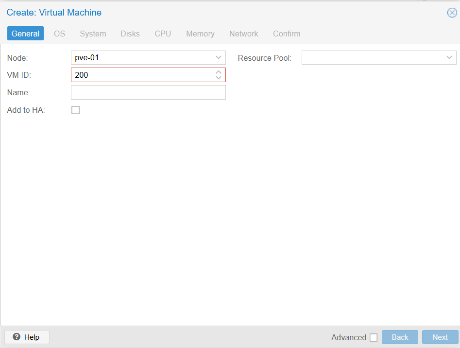

   * **OS:** Chọn kho `local`, chọn file ISO `Windows_Server_2022.iso`.

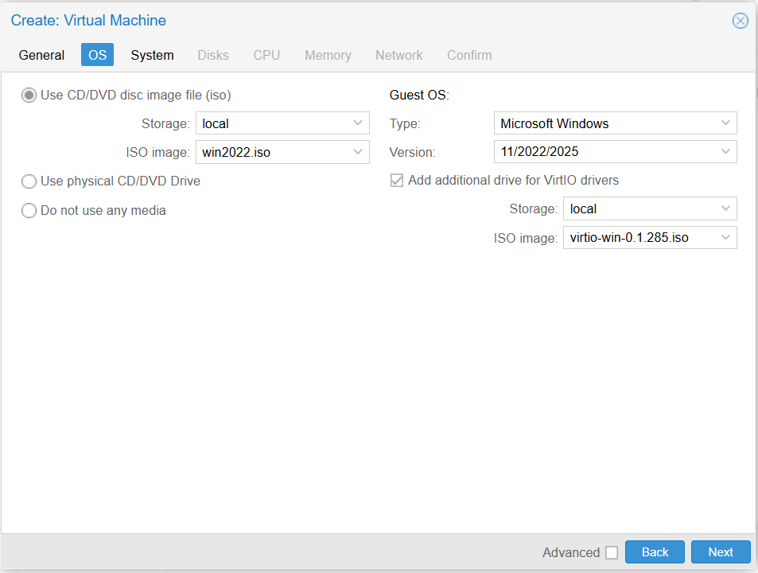

   * **System:** Tích chọn `Qemu Agent` (Để Proxmox quản lý IP và trạng thái máy ảo tốt hơn).

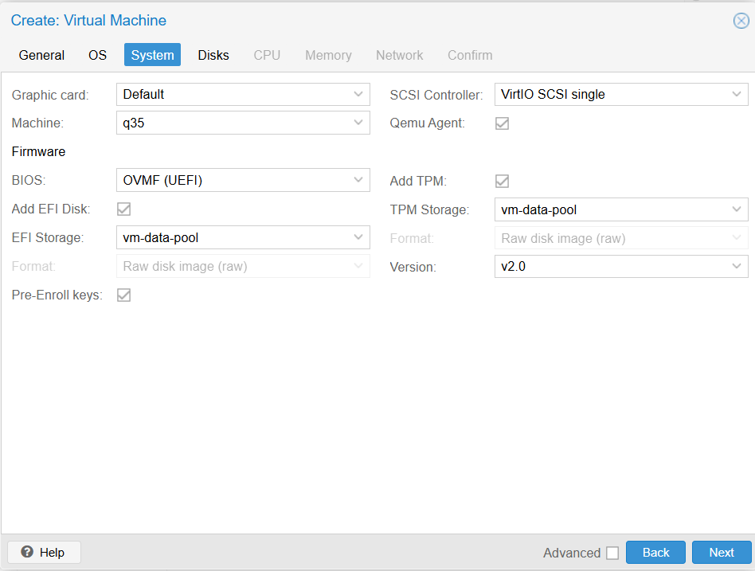

   * **Disks:**
     * Bus/Device: `SCSI`.
     * Storage: `vm-data-pool`.
     * Disk size: `40` GB.
     * Tích chọn `Discard` (Giúp giải phóng dung lượng ổ cứng thực tế).

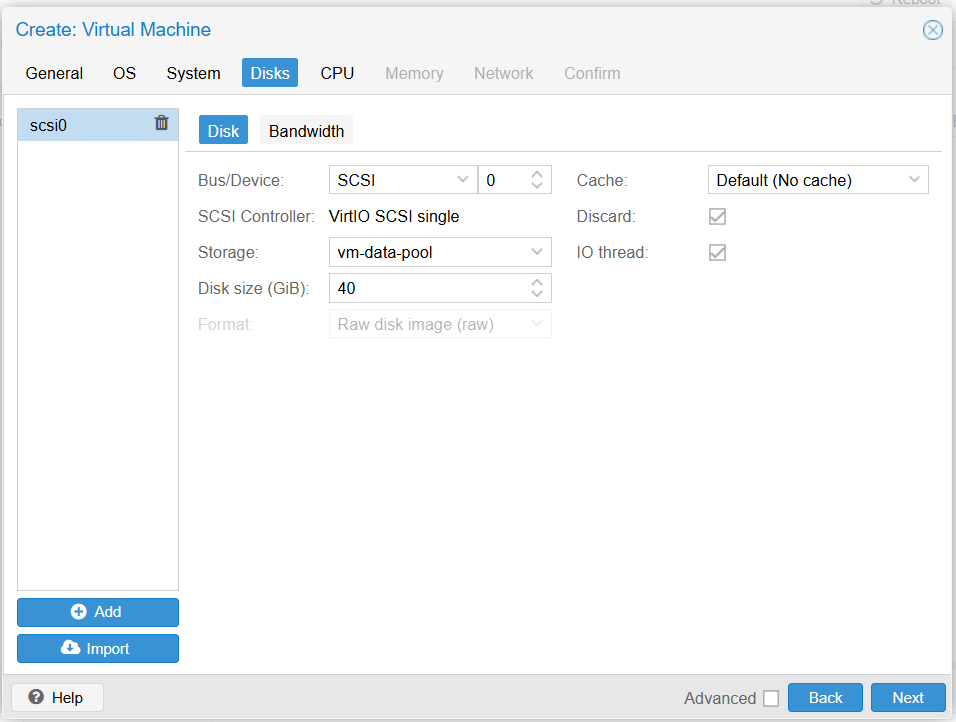

   * **CPU:** `1` Sockets, `2` Cores.

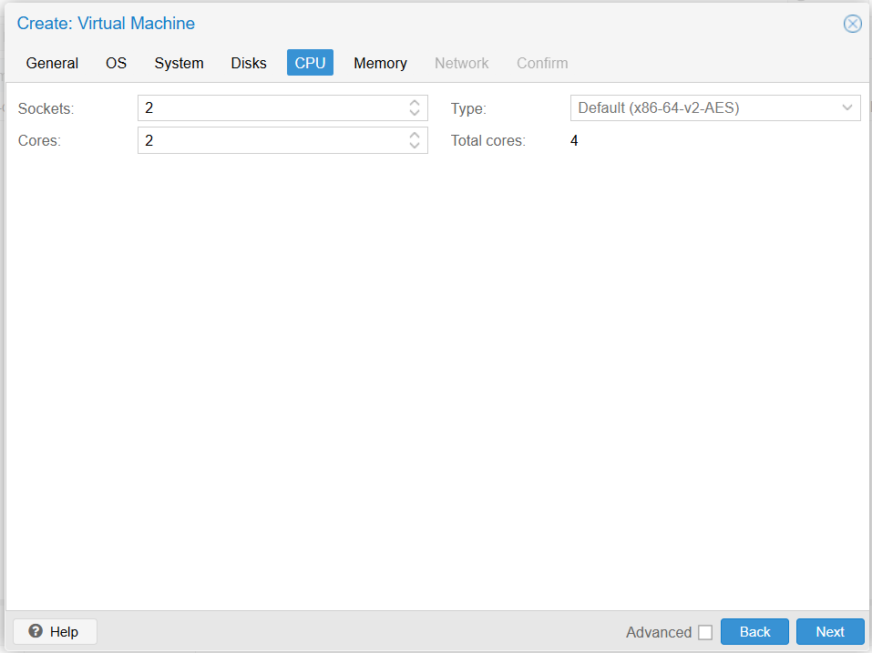

   * **Memory:** `4096` MB (4GB RAM).

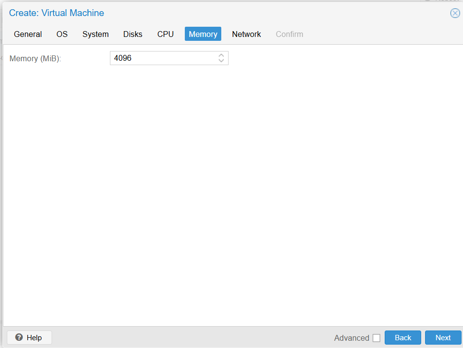

   * **Network:** * Bridge: **`vmbr1`**
     * **VLAN Tag:** `20` *(Bắt buộc: Để pfSense nhận diện đây là máy chủ thuộc VLAN 20).*
     * Model: `VirtIO`.

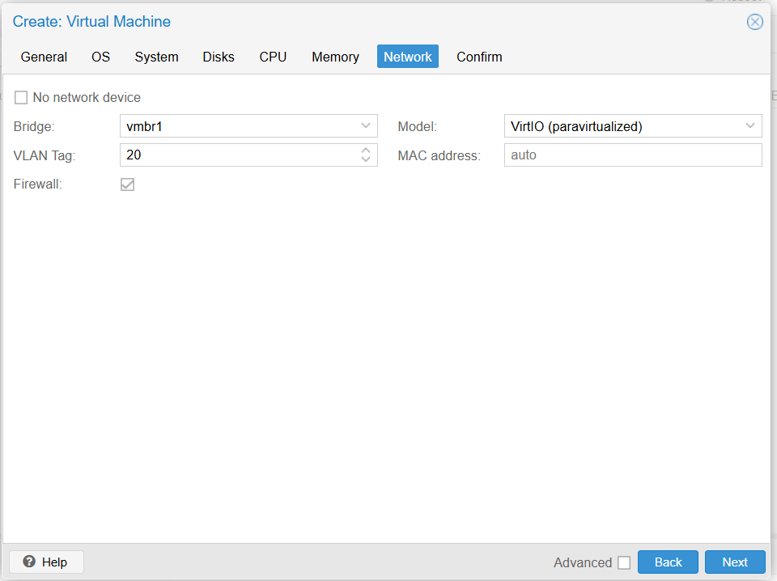

2. Nhấn **Finish**.


### 1.1 Thêm ổ đĩa chứa Driver VirtIO
Trước khi bật máy lên, ta cần gắn đĩa driver để bộ cài Windows nhận diện được ổ cứng SCSI và Card mạng:
1. Vào máy ảo `AD-DC01` → **Hardware** → **Add** → **CD/DVD Drive**.
2. Chọn kho `local`, chọn file ISO `virtio-win.iso`. Nhấn **Add**.


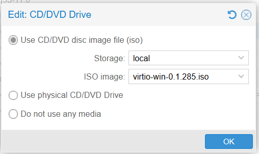

---

## Step 2 · Install Windows Server 2022

1. Khởi động VM (`Start`) và mở **Console**. Nhấn phím bất kỳ để boot vào màn hình cài đặt.
2. Chọn phiên bản **Windows Server 2022 Standard (Desktop Experience)**.
3. Khi đến bước chọn ổ đĩa (Where do you want to install Windows?), màn hình sẽ **trống trơn** (Do Windows không có sẵn driver ổ cứng ảo SCSI).
4. Nhấn **Load driver** → **Browse**.
5. Tìm đến ổ đĩa CD `virtio-win` → Thư mục `vioscsi` → `2k22` → `amd64`. Nhấn OK.
6. Ổ cứng 40GB sẽ xuất hiện. Tiếp tục chọn **Load driver** một lần nữa để cài driver Card mạng (Thư mục `NetKVM` → `2k22` → `amd64`).
7. Nhấn Next để tiến hành cài đặt hệ điều hành. Đặt mật khẩu cho tài khoản `Administrator` khi được yêu cầu.

*(Sau khi cài xong, vào lại phần Hardware trên Proxmox và tháo các file ISO ra).*

---

## Step 3 · Initial Configuration & Static IP

Sau khi đăng nhập vào Windows Server:

### 3.1 Cài đặt QEMU Guest Agent
1. Mở File Explorer, tìm đến ổ đĩa VirtIO (Nếu bạn chưa tháo ra).
2. Chạy file `virtio-win-guest-tools.exe` và cài đặt mặc định để Proxmox nhận diện đầy đủ thông số của VM.

### 3.2 Đổi tên Server (Hostname)
1. Mở **Server Manager** → **Local Server**.
2. Bấm vào tên máy tính ngẫu nhiên, đổi tên thành `AD-DC01`. Lời nhắc khởi động lại sẽ hiện ra, chọn *Restart Later*.

### 3.3 Đặt IP tĩnh (Static IP)
Do đây là Server trung tâm, không được phép nhận IP động từ pfSense:
1. Mở **Network Connections** (`ncpa.cpl`).
2. Chuột phải vào Card mạng → Properties → IPv4.
3. Cấu hình:
   * IP address: `10.20.20.10`
   * Subnet mask: `255.255.255.0`
   * Default gateway: `10.20.20.1` (IP của pfSense VLAN20)
   * Preferred DNS server: `127.0.0.1` (Trỏ về chính nó vì máy này sẽ làm máy chủ DNS).
4. Khởi động lại máy ảo (Reboot).

---

## Step 4 · Promote to Domain Controller (AD DS)

1. Mở **Server Manager** → Nhấn **Add roles and features**.
2. Cứ nhấn Next cho đến phần *Server Roles*. Tích chọn **Active Directory Domain Services** và **DNS Server**. Nhấn Add Features → Next → Install.
3. Sau khi cài xong, trên Server Manager sẽ có cờ cảnh báo màu vàng. Nhấn vào và chọn **Promote this server to a domain controller**.

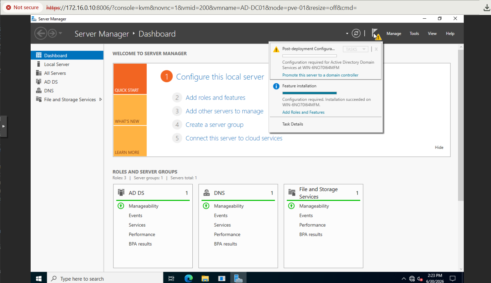

1. Chọn **Add a new forest**.
2. **Root domain name:** Nhập `enterprise.local` → Next.

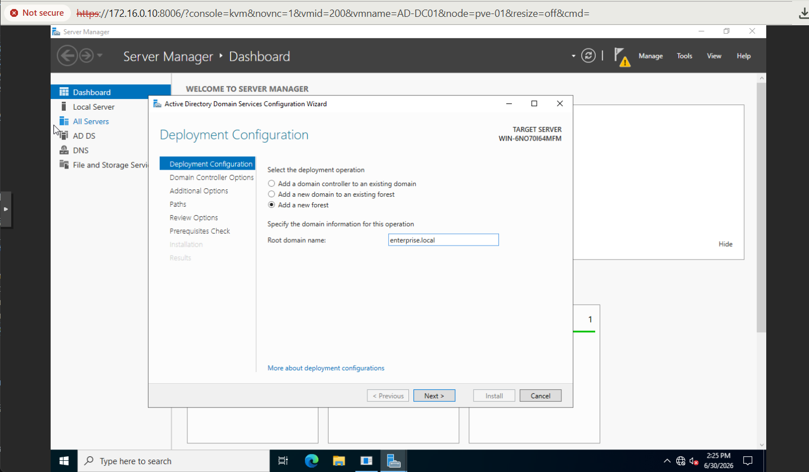

6. Đặt mật khẩu khôi phục DSRM (Directory Services Restore Mode) → Next liên tục đến phần Install.

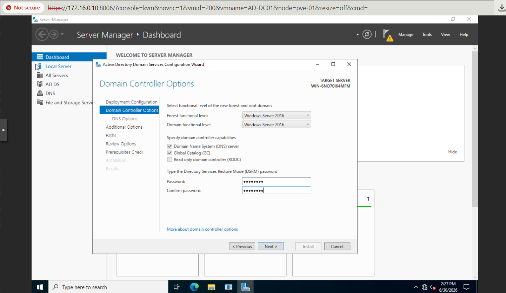

7. Máy chủ sẽ tự động khởi động lại. Lúc này, bạn đăng nhập bằng tài khoản miền: `ENTERPRISE\Administrator`.

---

## Step 5 · Structure OUs, Users & Groups (Chuẩn bị cho TrueNAS)

## Bước 1: Mở công cụ quản trị

1. Mở **Server Manager**.
2. Ở góc trên bên phải, chọn **Tools**.
3. Chọn **Active Directory Users and Computers**.

Một cửa sổ quản trị Active Directory sẽ được mở.

---

## Bước 2: Tạo OU cha (Company_Users)

1. Trong cửa sổ **Active Directory Users and Computers**, tại cột bên trái chọn tên domain:

```text
enterprise.local
```

2. Chuột phải vào domain → chọn:

```text
New → Organizational Unit
```

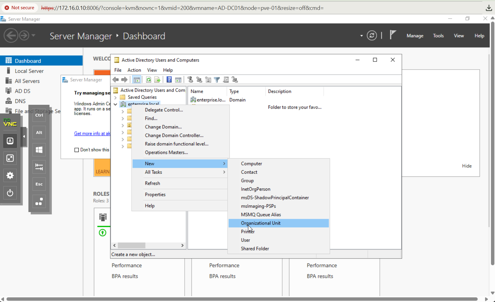


3. Tại ô **Name**, nhập:

```text
Company_Users
```
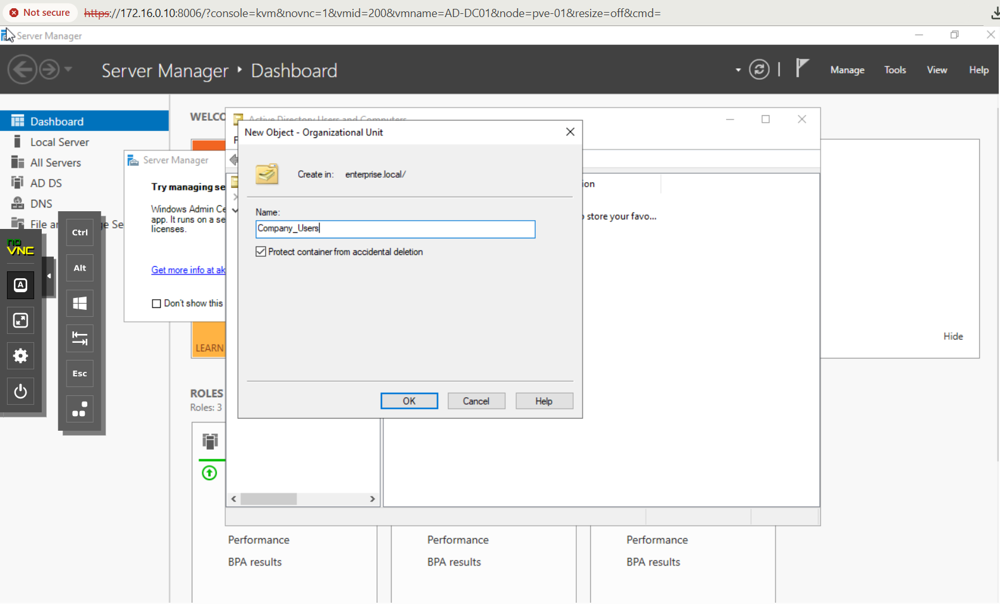

4. Nhấn **OK**.

> **Lưu ý:** Nếu không thấy tùy chọn tạo OU, vào menu **View** → tích chọn **Advanced Features**.

---

## Bước 3: Tạo các OU con (HR, IT, Sales)

1. Chuột phải vào OU vừa tạo:

```text
Company_Users
```

2. Chọn:

```text
New → Organizational Unit
```

3. Tạo lần lượt các OU sau:

```text
HR
IT
Sales
```

4. Nhấn **OK** sau mỗi lần tạo.

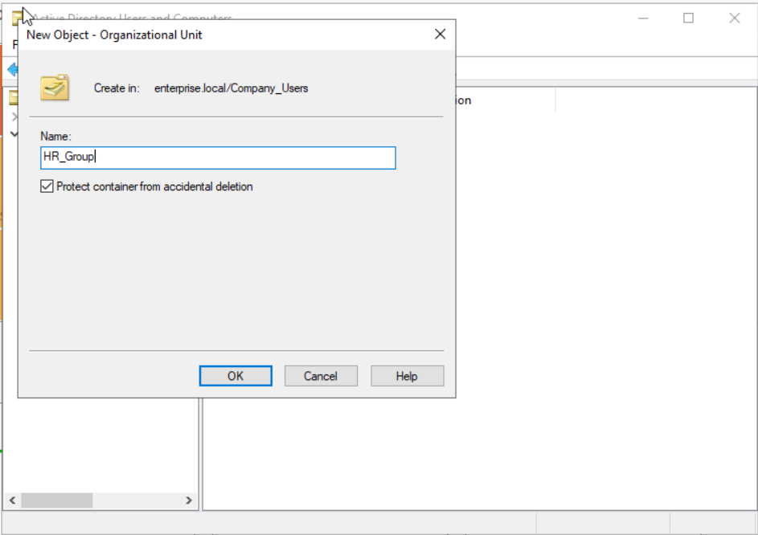

---

## Bước 4: Tạo Group cho từng phòng ban

Để thuận tiện phân quyền trên TrueNAS, nên tạo **Group trước**, sau đó thêm **User vào Group**.

### Tạo Group cho phòng HR

1. Chuột phải vào OU **HR**.
2. Chọn:

```text
New → Group
```

3. Nhập:

```text
HR_Group
```

4. Nhấn **OK**.

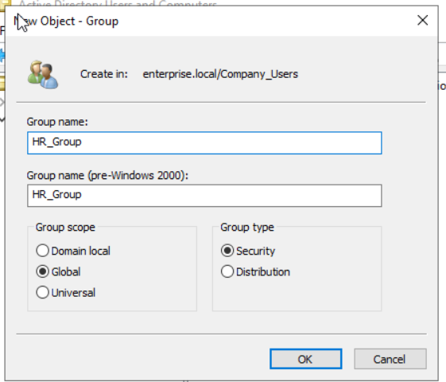

### Tạo Group cho các phòng còn lại

Thực hiện tương tự:

| OU    | Group       |
| ----- | ----------- |
| HR    | HR_Group    |
| IT    | IT_Group    |
| Sales | Sales_Group |


---

## Bước 5: Tạo User và thêm vào Group

Ví dụ thực hiện với phòng **HR**.

### Tạo User

1. Chuột phải vào OU **HR**.
2. Chọn:

```text
New → User
```

3. Điền thông tin:

| Trường          | Giá trị  |
| --------------- | -------- |
| First name      | hr       |
| User logon name | hr_user1 |

4. Nhấn **Next**.

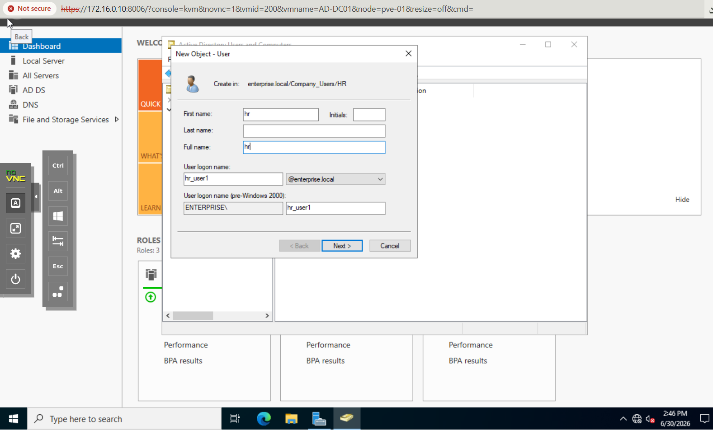


5. Đặt mật khẩu (ví dụ):

```text
Password123
```

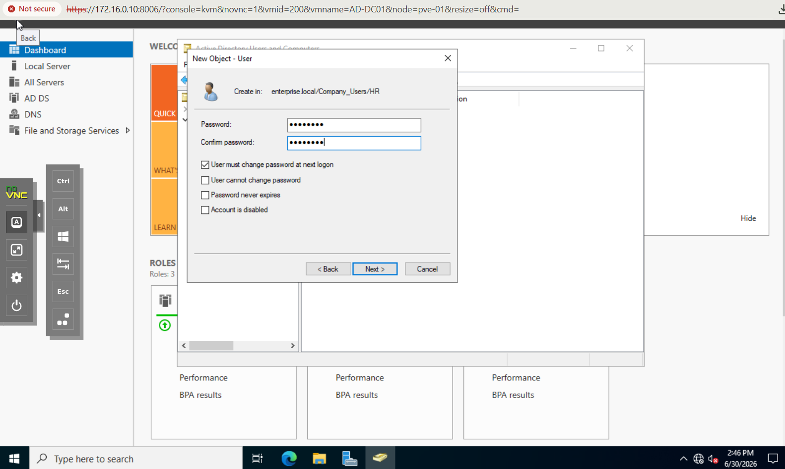


6. Bỏ chọn:

```text
User must change password at next logon
```

7. Nhấn:

```text
Next → Finish
```

---

### Thêm User vào Group

1. Chuột phải vào user:

```text
hr_user1
```

2. Chọn:

```text
Properties
```

3. Mở tab:

```text
Member Of
```

4. Chọn:

```text
Add...
```

5. Nhập tên nhóm:

```text
HR_Group
```

6. Chọn:

```text
Check Names
```

> Nếu tên nhóm được gạch chân nghĩa là tìm thấy đúng Group.

7. Nhấn:

```text
OK → Apply → OK
```

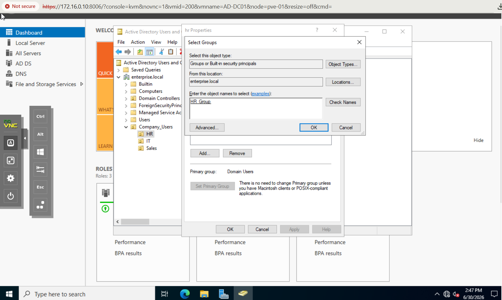

---

## Step 6 · Group Policy Configuration (GPO)


## Bước 1: Mở công cụ quản lý Group Policy

1. Mở **Server Manager**.
2. Ở góc trên bên phải, chọn **Tools**.
3. Chọn:

```text
Group Policy Management
```

Sau khi mở, cửa sổ **Group Policy Management** sẽ xuất hiện.

---

## Bước 2: Tạo và Link GPO cho phòng ban

### Điều hướng đến OU

Trong cửa sổ **Group Policy Management**, mở các thư mục theo thứ tự:

```text
Forest: enterprise.local
└── Domains
    └── enterprise.local
```

Tại đây sẽ xuất hiện OU:

```text
Company_Users
```

### Tạo GPO mới

1. Chuột phải vào:

```text
Company_Users
```

2. Chọn:

```text
Create a GPO in this domain, and Link it here...
```

3. Tại ô **Name**, nhập:

```text
Standard_Security_Policy
```

4. Nhấn **OK**.

### Kết quả

GPO mới sẽ được tạo và liên kết trực tiếp với OU.

```text
enterprise.local
└── Company_Users
    └── Standard_Security_Policy
```

---

## Bước 3: Chỉnh sửa GPO – Khóa Control Panel

### Mở trình chỉnh sửa GPO

1. Chuột phải vào GPO:

```text
Standard_Security_Policy
```

2. Chọn:

```text
Edit...
```

Cửa sổ **Group Policy Management Editor** sẽ xuất hiện.

---

### Điều hướng đến thiết lập Control Panel

Mở theo đường dẫn:

```text
User Configuration
└── Policies
    └── Administrative Templates
        └── Control Panel
```

Khi chọn **Control Panel**, nhìn sang khung bên phải và tìm chính sách:

```text
Prohibit access to Control Panel and PC settings
```

---

### Kích hoạt chính sách

1. Nhấp đúp vào:

```text
Prohibit access to Control Panel and PC settings
```

2. Chọn:

```text
Enabled
```

3. Nhấn:

```text
Apply → OK
```

### Kết quả

User thuộc OU được áp dụng GPO sẽ không thể truy cập:

* Control Panel
* PC Settings

---

## Bước 4: Chuẩn bị phần Map ổ đĩa mạng (TrueNAS)

Hiện tại chưa cấu hình ổ mạng, chỉ ghi nhớ vị trí cấu hình để sử dụng sau khi triển khai TrueNAS.

Trong **Group Policy Management Editor**, điều hướng:

```text
User Configuration
└── Preferences
    └── Windows Settings
        └── Drive Maps
```

Sau khi hoàn thành cài đặt TrueNAS, thực hiện:

```text
Drive Maps
→ Chuột phải
→ New
→ Mapped Drive
```

Sau đó điền:

* IP hoặc hostname của TrueNAS
* Đường dẫn Share (SMB)
* Ký tự ổ đĩa muốn ánh xạ

Ví dụ:

```text
\\192.168.1.100\Department
→ Drive Letter: Z:
```

> Hiện tại chưa cần cấu hình phần này. Có thể đóng cửa sổ **Group Policy Management Editor**.

---

## Result Check-list

* [x] Windows Server 2022 đã được cài đặt lên đĩa SCSI thông qua VirtIO driver.
* [x] Máy ảo đã được gán thẻ VLAN 20 và có thể ping ra internet thông qua pfSense Gateway.
* [x] Đã nâng cấp thành công lên Domain Controller với domain `enterprise.local`.
* [x] Cấu trúc OUs, Users và Security Groups (HR, IT, Sales) đã sẵn sàng để đồng bộ với TrueNAS.