# 06 · Enterprise Storage (TrueNAS SCALE)

## Objective

Triển khai **TrueNAS SCALE** làm hệ thống lưu trữ tập trung cho doanh nghiệp. 
Điểm nhấn của bài này là tích hợp TrueNAS vào **Active Directory (AD-DC01)** để thực hiện phân quyền truy cập tập tin (SMB) theo đúng phòng ban (HR, IT, Sales) đã cấu hình trong Phase 3.

---

## Environment & Network Strategy

TrueNAS sẽ nằm trong vùng **Storage Zone (VLAN 30)**, tách biệt hoàn toàn với vùng máy chủ và vùng người dùng để đảm bảo an toàn dữ liệu.

| Component | Value | Note |
| :--- | :--- | :--- |
| **VM Name** | `TrueNAS-SCALE` | Hệ điều hành lưu trữ chuyên dụng |
| **Network** | Bridge `vmbr1`, **VLAN Tag: 30** | Thuộc vùng mạng STORAGE |
| **Static IP** | `10.30.30.10/24` | Gateway: `10.30.30.1` (pfSense) |
| **DNS Server** | `10.20.20.10` | Trỏ về AD-DC01 để xác thực tên miền |

---

## Step 1 · Create TrueNAS VM on Proxmox

# Bước 1: Khởi tạo máy ảo (VM) trên Proxmox

Truy cập giao diện **Proxmox Web UI** và nhấn **Create VM**.

---

## Tab General

| Thuộc tính | Giá trị         |
| ---------- | --------------- |
| VM ID      | `300`           |
| Name       | `TrueNAS-SCALE` |

→ Nhấn **Next**

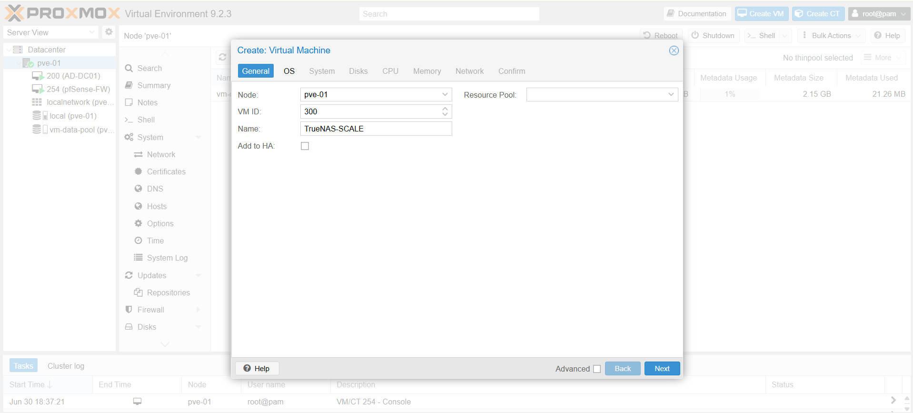

---

## Tab OS

| Thuộc tính    | Giá trị                                       |
| ------------- | --------------------------------------------- |
| ISO Image     | `TrueNAS-SCALE-*.iso` *(đã upload lên local)* |
| Guest OS Type | `Linux`                                       |
| Version       | `6.x - 2.6 Kernel`                            |

→ Nhấn **Next**

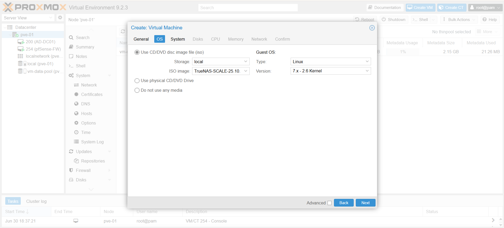
---

## Tab System

Giữ nguyên toàn bộ thiết lập mặc định.

→ Nhấn **Next**

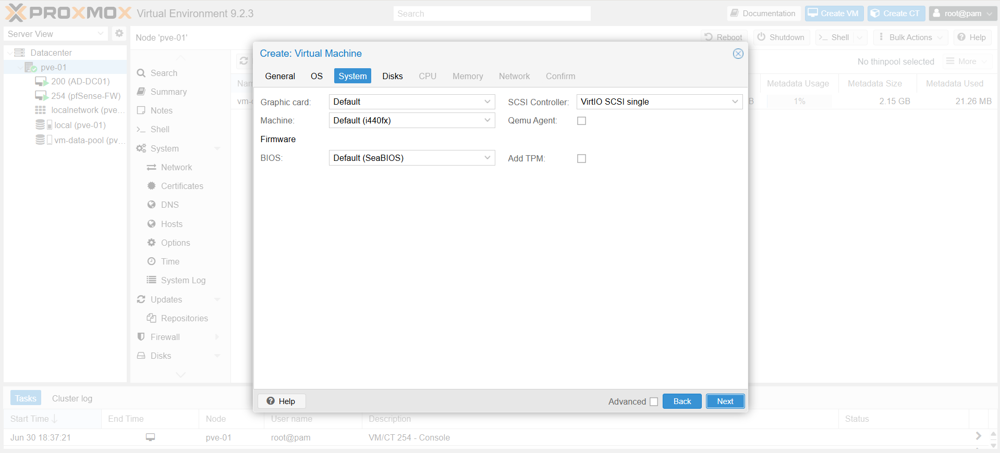
---

## Tab Disks

| Thuộc tính | Giá trị                    |
| ---------- | -------------------------- |
| Bus/Device | `VirtIO Block` hoặc `SCSI` |
| Storage    | `vm-data-pool`             |
| Disk Size  | `32 GB`                    |

> Đây là ổ đĩa dùng để cài đặt hệ điều hành **TrueNAS SCALE**.

→ Nhấn **Next**

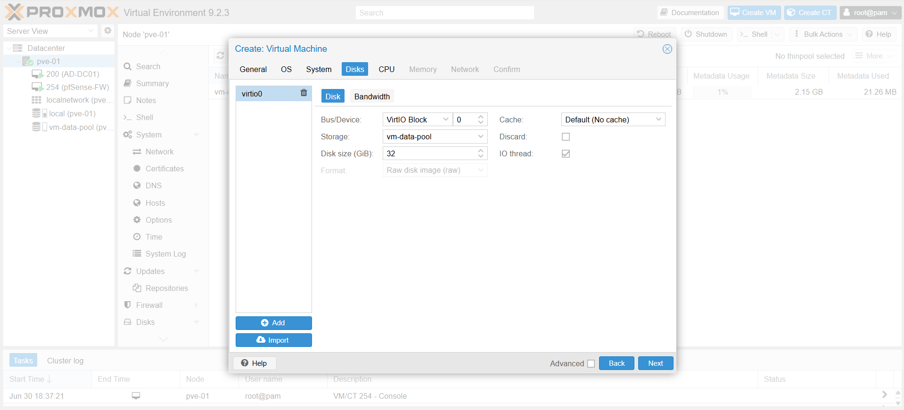
---

## Tab CPU

| Thuộc tính | Giá trị     |
| ---------- | ----------- |
| Cores      | `2` |


→ Nhấn **Next**

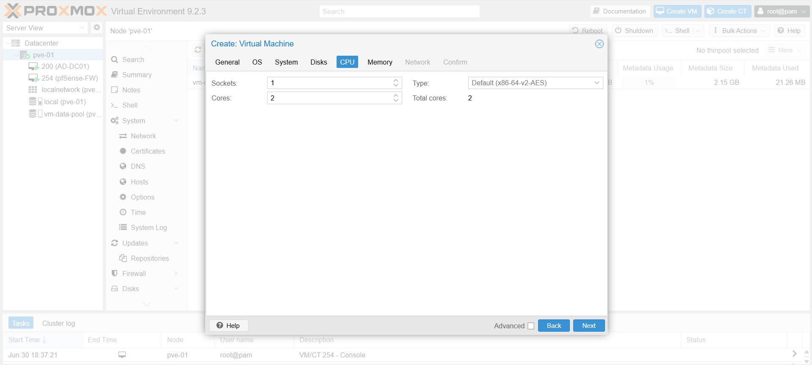
---

## Tab Memory

| Thuộc tính | Giá trị          |
| ---------- | ---------------- |
| Memory     | `8192 MB (8 GB)` |

> **Lưu ý quan trọng:** TrueNAS sử dụng **ZFS**, bộ nhớ RAM ảnh hưởng trực tiếp tới hiệu năng cache, tốc độ đọc/ghi và khả năng vận hành ổn định.

→ Nhấn **Next**

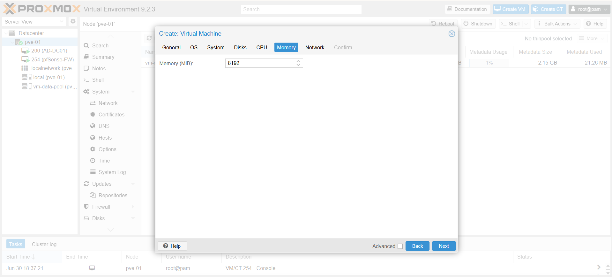

---

## Tab Network

| Thuộc tính | Giá trị  |
| ---------- | -------- |
| Bridge     | `vmbr1`  |
| Model      | `VirtIO` |
| VLAN Tag   | `30`     |

→ Nhấn **Next**

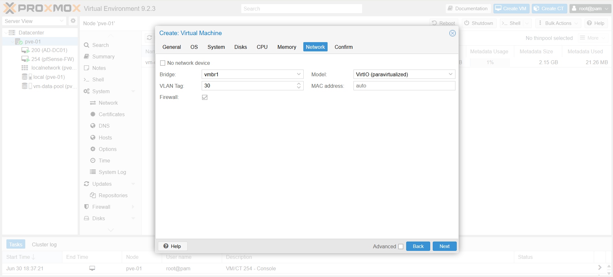

---

## Finish

Kiểm tra lại toàn bộ cấu hình và nhấn **Finish** để tạo máy ảo.

---

# Thêm ổ dữ liệu (Data Disk)

Sau khi VM được tạo:

1. Chọn VM **TrueNAS-SCALE**
2. Chuyển sang tab **Hardware**
3. Nhấn **Add → Hard Disk**

Thiết lập:

| Thuộc tính | Giá trị                                          |
| ---------- | ------------------------------------------------ |
| Size       | Ví dụ `100 GB`                                   |
| Bus/Device | `SCSI` *(hoặc VirtIO Block để đồng bộ cấu hình)* |

→ Nhấn **Add**

> Đây sẽ là ổ lưu trữ dữ liệu độc lập với ổ cài hệ điều hành.


---

# Bước 2: Cài đặt TrueNAS SCALE

## Khởi động máy ảo

* Nhấn **Start**
* Mở **Console**

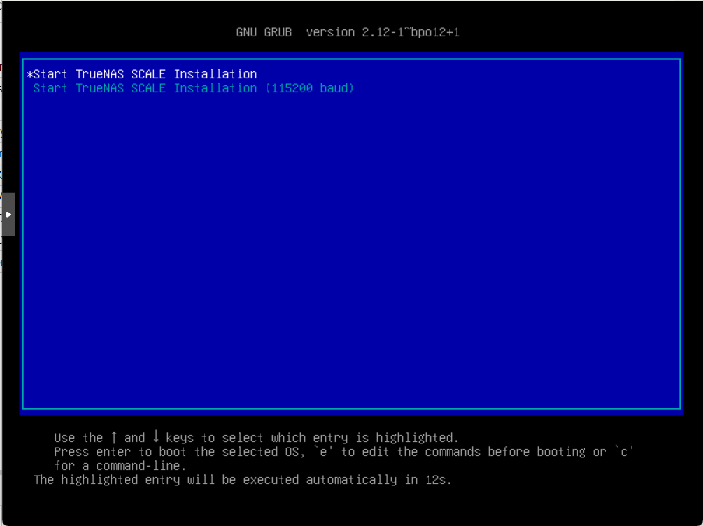
---

## Trình cài đặt

Khi menu xuất hiện:

→ Chọn **Install/Upgrade**

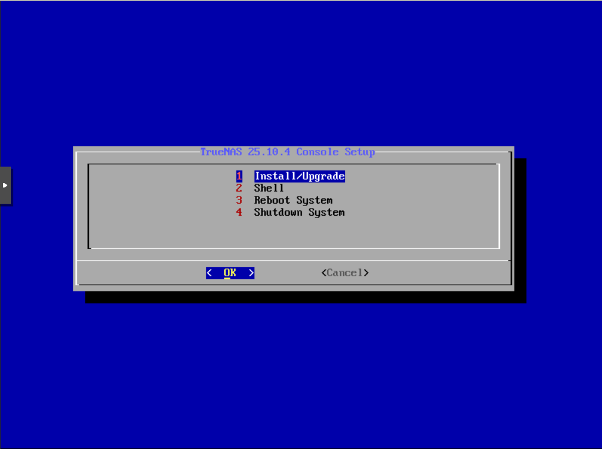

---

## Chọn ổ cài đặt

Danh sách ổ đĩa sẽ xuất hiện.

* Chọn ổ **32GB** *(thường là ổ đầu tiên)*
* Nhấn **Space** để đánh dấu
* Nhấn **Enter** để tiếp tục

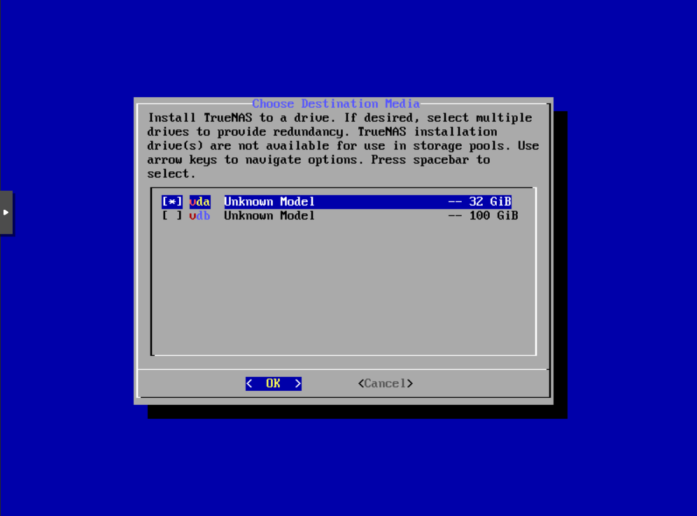

---

## Xác nhận xóa dữ liệu

Trình cài đặt sẽ cảnh báo xóa toàn bộ dữ liệu trên ổ OS.

→ Chọn **Yes**

---

## Thiết lập mật khẩu Root

Nhập mật khẩu cho tài khoản:

```text
truenas_admin
```
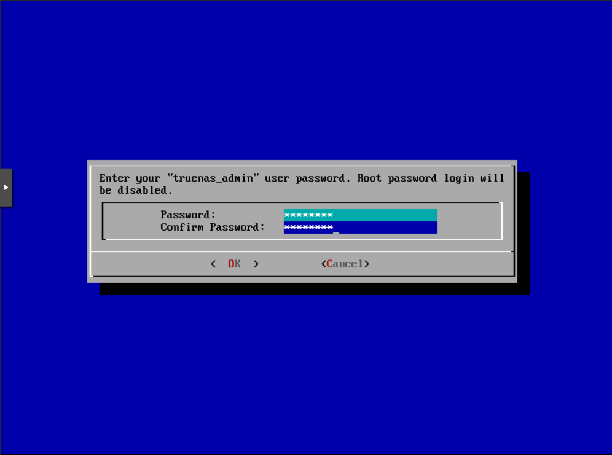

---

## Cấu hình Boot

Chọn:

```text
Boot via UEFI
```

> Khuyến nghị sử dụng UEFI cho môi trường ảo hóa hiện đại.

---

## Hoàn tất cài đặt

Sau khi cài đặt xong:

1. Chọn **Reboot**
2. Quay lại **Proxmox**
3. Mở **Hardware**
4. Tháo file **ISO** khỏi máy ảo

> Tránh việc máy khởi động lại vào trình cài đặt.

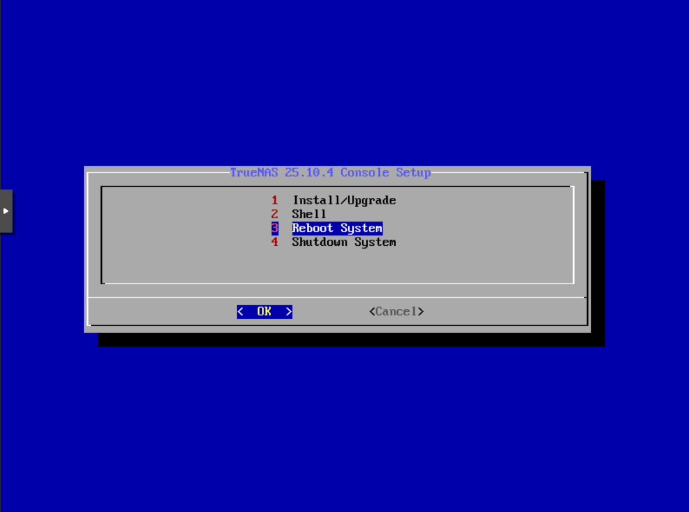

---

# Bước 3: Cấu hình mạng (Cố định IP)

Sau khi TrueNAS khởi động, màn hình Console sẽ hiển thị menu cấu hình.

---

## Cấu hình Interface

Chọn:

```text
1) Configure Network Interfaces
```
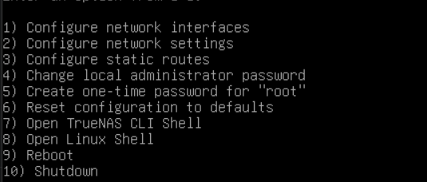

Chọn interface:

```text
ens18
```
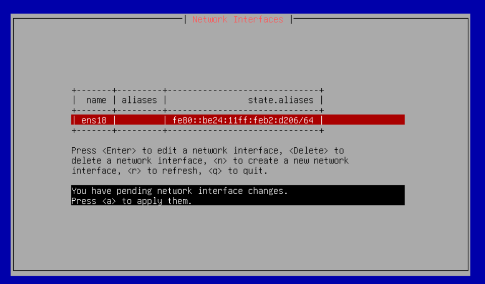

Nếu đang nhận IP từ DHCP:

→ Chọn **Delete interface configuration**

---

## Thiết lập IP tĩnh

| Thuộc tính                   | Giá trị       |
| ---------------------------- | ------------- |
| Configure interface for DHCP | `No`          |
| Configure IPv4               | `Yes`         |
| Interface Name               | `enp0s18`     |
| IP Address                   | `10.30.30.10` |
| Netmask                      | `24`          |

---

## Thiết lập Gateway & DNS cho TrueNAS

``` text
Chọn 2 - Configure Network Settings
```

### Cấu hình IPv4 Default Gateway


Thiết lập:

| Thuộc tính           | Giá trị      |
| -------------------- | ------------ |
| IPv4 Default Gateway | `10.30.30.1` |

> Đây là địa chỉ **Gateway của pfSense thuộc VLAN 30**, cho phép máy chủ **TrueNAS** giao tiếp với các mạng khác ngoài subnet hiện tại.


---

## Cấu hình DNS Server

Tiếp tục trong phần cấu hình mạng, hệ thống sẽ yêu cầu nhập thông tin **Nameserver (DNS)**.

Thiết lập:

| Thuộc tính   | Giá trị       |
| ------------ | ------------- |
| Nameserver 1 | `10.20.20.10` |

> **Lý do:** Đây là máy chủ DNS nội bộ (**AD-DC01**).
> Bước này bắt buộc để TrueNAS có thể phân giải tên miền nội bộ như:

```text
enterprise.local
```

Nếu không cấu hình DNS nội bộ, TrueNAS sẽ không thể:

* Phân giải tên miền `enterprise.local`
* Join Domain Active Directory
* Giao tiếp với các dịch vụ nội bộ sử dụng tên miền thay vì địa chỉ IP

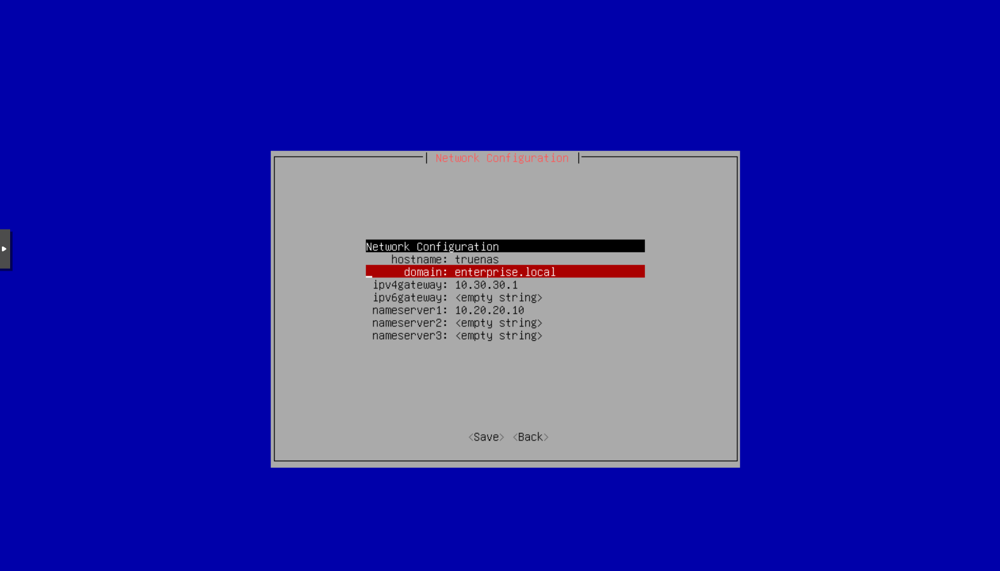

---

# Bước 4: Truy cập WebUI và hoàn tất

Từ trình duyệt trên máy **AD-DC01** hoặc máy khác trong mạng:

```text
http://10.30.30.10
```

---

## Đăng nhập

| Thuộc tính | Giá trị                        |
| ---------- | ------------------------------ |
| Username   | `root`                         |
| Password   | Mật khẩu đã tạo ở bước cài đặt |

---

## Kiểm tra ổ dữ liệu

Đi tới:

```text
Storage → Disks
```

Xác nhận ổ dữ liệu **100GB** đã xuất hiện.

---

## Tạo ZFS Pool

Đi tới:

```text
Storage → Pools → Add → Create Pool
```

Thiết lập ví dụ:

| Thuộc tính | Giá trị        |
| ---------- | -------------- |
| Pool Name  | `STORAGE_POOL` |
| Disk       | Chọn ổ dữ liệu |

→ Xác nhận tạo Pool.

Sau khi hoàn tất, hệ thống **TrueNAS SCALE** đã sẵn sàng để tạo SMB Share, NFS, iSCSI hoặc làm NAS nội bộ cho môi trường Lab.


---

## Step 2 · Install & Initial Configuration

1. Boot VM và thực hiện cài đặt theo hướng dẫn của trình cài đặt TrueNAS.
2. Sau khi cài xong, truy cập vào giao diện Web qua IP mặc định (chuyển sang Static IP `10.30.30.10` qua menu Console).
3. Truy cập WebUI: `http://10.30.30.10`.

---

## Step 3 · Integrate with Active Directory

Đây là bước quan trọng để TrueNAS nhận diện được các Users và Groups từ máy chủ AD-DC01.

1. **Cấu hình DNS:** Vào **Network > Global Configuration**, đảm bảo DNS trỏ về `10.20.20.10` (IP của AD-DC01).
2. **Join Domain:**
   * Vào **Directory Services > Active Directory**.
   * **Domain Name:** `enterprise.local`.
   * **Domain Account Name / Password:** Nhập tài khoản Administrator của domain.
   * Nhấn **Save** và **Join Domain**.
3. Xác nhận đã Join thành công bằng cách kiểm tra lệnh `wbinfo -u` trong Shell (phải thấy danh sách user như `hr_user1`).

---

## Step 4 · Create Datasets & SMB Share

Phân quyền dữ liệu theo cấu trúc OU đã tạo ở Phase 3.

### 4.1 Tạo Pool & Datasets
1. Vào **Storage**, tạo một **Pool** mới từ ổ cứng dữ liệu.
2. Tạo các **Datasets** bên trong Pool theo cấu trúc phòng ban:
   * `DATA/HR`
   * `DATA/IT`
   * `DATA/Sales`

### 4.2 Thiết lập SMB Share
1. Vào **Shares > Windows Shares (SMB)**.
2. Nhấn **Add**, chọn Dataset `DATA/HR`.
3. Thiết lập **ACL (Access Control List)**:
   * Xóa các quyền mặc định.
   * Thêm quyền cho **Group**: `HR_Group` (Full Control).
   * Thêm quyền cho **Group**: `Domain Admins` (Full Control).
4. Thực hiện tương tự cho các dataset IT và Sales với các Group tương ứng (`IT_Group`, `Sales_Group`).

---

## Step 5 · Verification & Mapping

1. Trên máy Windows 11 Client (VLAN 10), đăng nhập bằng tài khoản `hr_user1`.
2. Mở File Explorer, gõ địa chỉ: `\\10.30.30.10`.
3. Kiểm tra:
   * User `hr_user1` có thể đọc/ghi trong thư mục `HR`.
   * User `hr_user1` **không thể** truy cập vào thư mục `IT` hoặc `Sales`.

---

## Result Check-list

* [x] TrueNAS đã được Join Domain thành công vào `enterprise.local`.
* [x] Đã thiết lập Dataset phân cấp theo phòng ban (HR, IT, Sales).
* [x] Phân quyền SMB sử dụng Security Groups của Active Directory đã hoạt động.
* [x] Mạng lưu trữ (VLAN 30) đã thông suốt với mạng người dùng (VLAN 10) nhờ pfSense Inter-VLAN Routing.